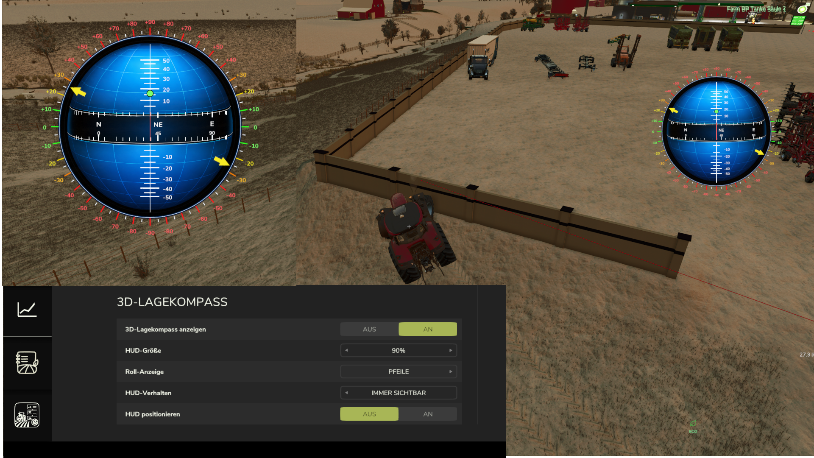

LS25 3D Lagekompass

zeigt alle Neigungen eines Fahzeuges an als eigener Kompass. Es zeigt in der Mitte die Kompasswerte an, dazu werden die Neigungswinkel Hoch und Runter angezeigt , oberhalb positiver, unterhalb negativer
Winkel. An den Äußeren Rändern wird der Rollwinkel des Fahrzeuges angezeigt. Durch die Pfeile an den Gradzahlen oder umschaltbar als Punkte.

Weiterhin kann der Kompass frei verschoben werden, in der Größe skalliert werden und es kann eingestellt werden ob der Kompass mit dem UserInterface Global ausgeblendet wird oder ob er sichtbar bleibt.
In den Settings gibt es alle entsprechenden Optionen. 

Update:
Verschiebbar auch über Tastenkombi gelegt strg+0
Kameralock deaktivert wärend des verschieben

